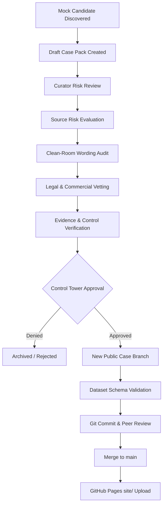

# Promotion Gate Policy & Publication Safeguards

This document defines the strict publication controls, gating mechanisms, and validation steps required to promote discovery draft cases to public Atlas Incident records.

> [!IMPORTANT]
> **CORE PROMOTION PRINCIPLE**
> Public record creation is **always** a manual, high-assurance administrative action executed through distinct branches. No draft case can self-promote or trigger direct database insertion.

---

## The Promotion Pathway

Every case follows a structured progression to ensure compliance with the clean-room policy, legal vetting guidelines, and evidence-control verification.

### Pathway Stages

1. **Discovery Draft**: Drafts reside in `data/drafts/` (or `data/drafts/mock/` for testing) and contain unstructured details, source URLs, and taxonomical indices.
2. **Curator Review**: Active review by an designated human curator verifying that the source represents an eligible artificial intelligence regulatory incident.
3. **Source Risk Review**: Validation of source credentials. Sources categorized as **Yellow** or **Red** risks must never proceed without explicit risk hardening.
4. **Clean-Room Wording Review**: Refactoring of the narrative to guarantee compliance with third-party intellectual property licenses and neutral documentation styles.
5. **Legal & Commercial Risk Review**: Dedicated legal vetting if named companies or sensitive commercial liabilities are referenced.
6. **Evidence & Control Completeness Review**: Checks that the required evidence audits and suggested control questions map correctly to the Case-to-Control taxonomy.
7. **Control Tower Approval**: Final human gate-keeper sign-off.
8. **Public Case Branch Creation**: A separate Git branch is created specifically for the new public case (e.g., `feat/INC-0013-resume-screening`).
9. **Validator Run**: Executing `python3 tools/validate_dataset.py` locally and in CI to guarantee schema conformity.
10. **Commit, Merge & Publish**: Clean code is merged into `main` which triggers the GitHub Pages action to upload *only* the `site/` folder.

---

## Immutable Safeguards

To prevent safety bypasses or synthetic database pollution, the following limits are built into the system:

* **No Self-Promotion**: Gating code, watch scripts, and preview generators are static and run outside the site boundary. They possess no credentials or routines to modify files under `site/` dynamically.
* **No Mock Data Promotion**: Synthetic datasets (contained in `data/candidates/mock/`, `data/drafts/mock/`, and `data/digests/mock/`) are programmatically blocked from public syndication. Validators explicitly fail if any mock indices or mock IDs (e.g., `CAND-`, `DRAFT-`, or `INC-0013` mock variant) appear under `site/`.
* **High-Risk Source Block**: No **Yellow** or **Red** tier sources can auto-publish under any circumstances, even if other parameters are compliant.
* **Company Sensitivity Review**: Any discovery involving named companies requires a high-assurance clean-room review to ensure neutral phrasing and legal defense against defamation or trademark claims.
